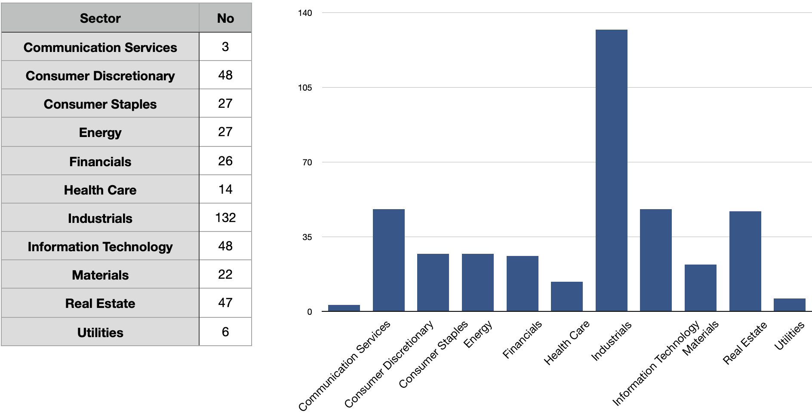
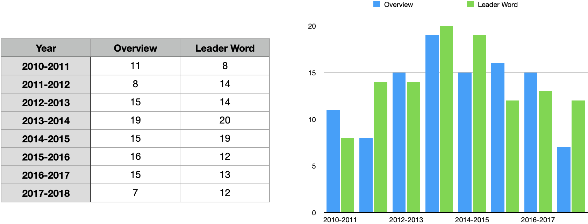
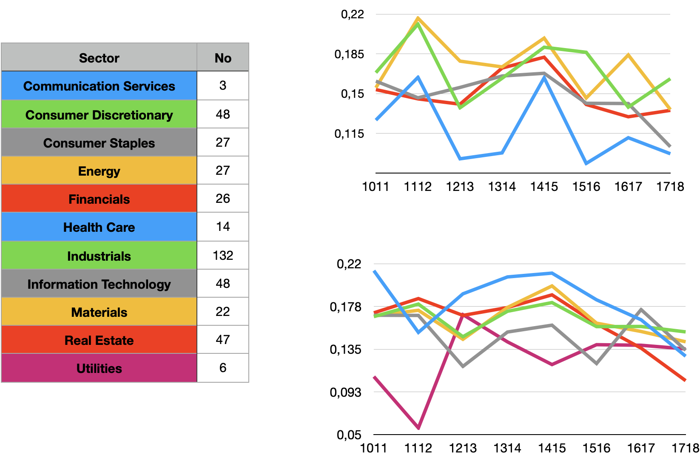
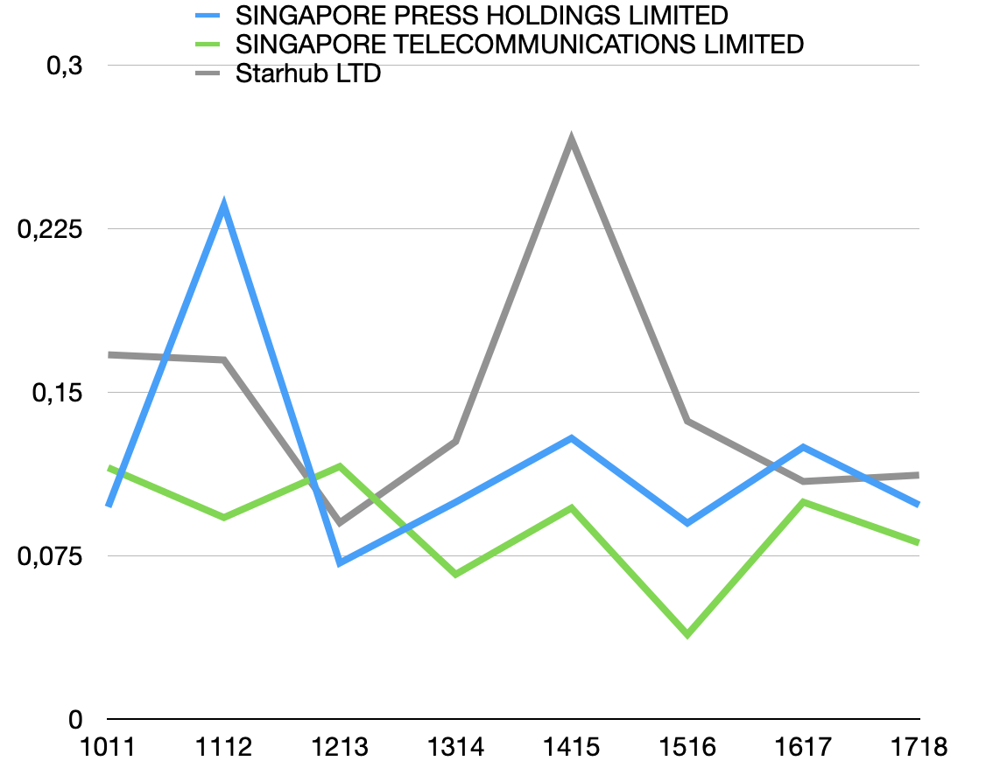
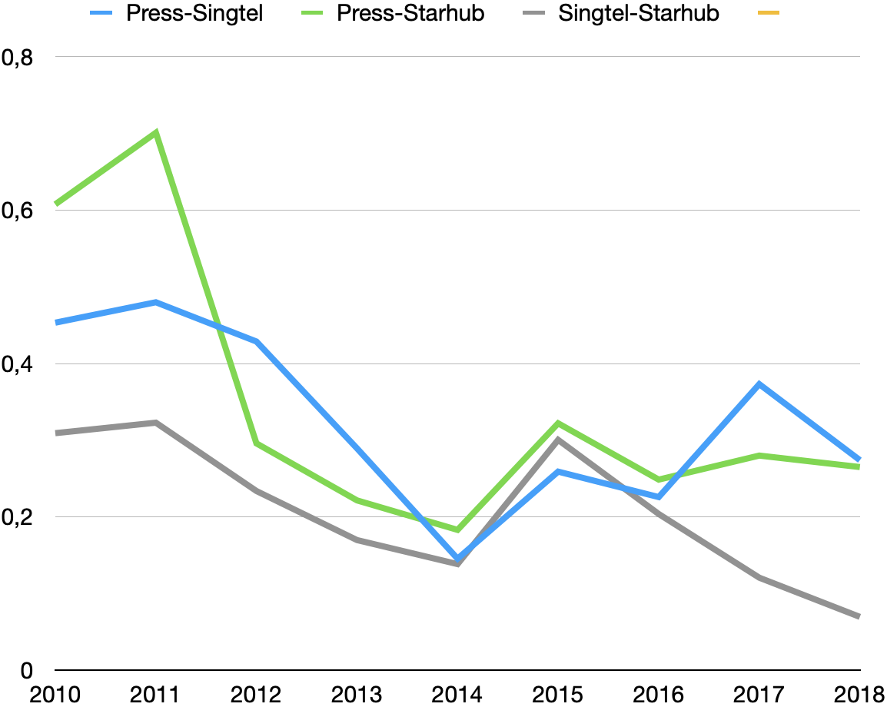

# SGX_reports


[](http://quantlet.de/)

## [](http://quantlet.de/) **SGX_reports** [](http://quantlet.de/)

```yaml


Name of Quantlet: Singapore Exchange Annual Reports  

Published in: SGX_reports

Description: Analysis the SGX annual report with NLP models (Joint project with SMU)

Keywords: LDA, topic modelling, annual reports, sustainability, regulations

See also: Regulatory-risk-cryptocurrency

Author: Xinwen Ni

Submitted:  20 Feb 2022


```











### PYTHON Code
```python

# import package 
import os
import re
import pandas as pd
## `nltk.download('punkt')
import numpy as np

# NLTK
from nltk.corpus import stopwords
from nltk.tokenize import RegexpTokenizer
from nltk.stem.porter import PorterStemmer
from nltk.stem.wordnet import WordNetLemmatizer
from gensim.models import Phrases
import nltk
nltk.download('stopwords')

# Gensim
import gensim
import gensim.corpora as corpora
from gensim.utils import simple_preprocess
from gensim.models import CoherenceModel
from gensim.matutils import kullback_leibler, jaccard, hellinger, sparse2full
#from gensim.test.utils import common_corpus
from gensim.models import LdaModel
from gensim.test.utils import datapath
from gensim.models import LdaSeqModel
#from gensim.corpora import Dictionary, bleicorpus
#from gensim import models, similarities

# spacy for lemmatization
import spacy
from scipy.stats import wasserstein_distance

# Plotting tools
import pyLDAvis
import pyLDAvis.gensim  # don't skip this
import matplotlib.pyplot as plt
#matplotlib inline

# Enable logging for gensim - optional
import logging
logging.basicConfig(format='%(asctime)s : %(levelname)s : %(message)s', level=logging.ERROR)

import matplotlib.pyplot as plt
from collections import  defaultdict
from pprint import pprint

#import data
df_temp=pd.read_csv('Cleaned_reports_2.csv',sep=';')

# load the firm information
Firm_ID=pd.read_csv('Company.csv',sep=';')

##########################################################
# sub set of data according to year information  
##########################################################

df_10=df_temp.loc[df_temp['Year'] == 2010]
df_11=df_temp.loc[df_temp['Year'] == 2011]
df_12=df_temp.loc[df_temp['Year'] == 2012]
df_13=df_temp.loc[df_temp['Year'] == 2013]
df_14=df_temp.loc[df_temp['Year'] == 2014]
df_15=df_temp.loc[df_temp['Year'] == 2015]
df_16=df_temp.loc[df_temp['Year'] == 2016]
df_17=df_temp.loc[df_temp['Year'] == 2017]
df_18=df_temp.loc[df_temp['Year'] == 2018]

df_1011=pd.concat([df_10,df_11])
df_1112=pd.concat([df_11,df_12])
df_1213=pd.concat([df_12,df_13])
df_1314=pd.concat([df_13,df_14])
df_1415=pd.concat([df_14,df_15])
df_1516=pd.concat([df_15,df_16])
df_1617=pd.concat([df_16,df_17])
df_1718=pd.concat([df_17,df_18])

df_1011= df_1011[df_1011.groupby('Firm_Id').Firm_Id.transform(len) ==2]
df_1112= df_1112[df_1112.groupby('Firm_Id').Firm_Id.transform(len) ==2]
df_1213= df_1213[df_1213.groupby('Firm_Id').Firm_Id.transform(len) ==2]
df_1314= df_1314[df_1314.groupby('Firm_Id').Firm_Id.transform(len) ==2]
df_1415= df_1415[df_1415.groupby('Firm_Id').Firm_Id.transform(len) ==2]
df_1516= df_1516[df_1516.groupby('Firm_Id').Firm_Id.transform(len) ==2]
df_1617= df_1617[df_1617.groupby('Firm_Id').Firm_Id.transform(len) ==2]
df_1718= df_1718[df_1718.groupby('Firm_Id').Firm_Id.transform(len) ==2]

##########################################################
# LDA 
##########################################################


def clean_data(data):
    # Remove Emails
    data = [re.sub('\S*@\S*\s?', '', sent) for sent in data]
    
    # Remove new line characters
    data = [re.sub('\s+', ' ', sent) for sent in data]
    
    # Remove distracting single quotes
    data = [re.sub("\'", "", sent) for sent in data]
    
    pprint(data[:1])
    return data

def sent_to_words(sentences):
    for sentence in sentences:
        yield(gensim.utils.simple_preprocess(str(sentence), deacc=True))  # deacc=True removes punctuations
# Define functions for stopwords, bigrams, trigrams and lemmatization
def remove_stopwords(texts):
    return [[word for word in simple_preprocess(str(doc)) if word not in stop_words] for doc in texts]

#def make_bigrams(texts):
#    return [bigram_mod[doc] for doc in texts]
#
#def make_trigrams(texts):
#    return [trigram_mod[bigram_mod[doc]] for doc in texts]

def lemmatization(texts, allowed_postags=['NOUN', 'ADJ', 'VERB', 'ADV']):
    """https://spacy.io/api/annotation"""
    texts_out = []
    for sent in texts:
        doc = nlp(" ".join(sent)) 
#        texts_out.append([token.lemma_ for token in doc if token.pos_ in allowed_postags])
        texts_out.append([token.lemma_ for token in doc])
    return texts_out

def lemmatization1(texts, allowed_postags=['NOUN', 'ADJ', 'VERB', 'ADV']):
    """https://spacy.io/api/annotation"""
    texts_out = []
    for sent in texts:
        doc = nlp(" ".join(sent)) 
        texts_out.append([token.lemma_ for token in doc if token.pos_ in allowed_postags])
#        texts_out.append([token.lemma_ for token in doc])
    return texts_out

def get_lemm(data):
    data_words = list(sent_to_words(data))
#    print(data_words[:1])
    
    # Build the bigram and trigram models
#    bigram = gensim.models.Phrases(data_words, min_count=5, threshold=100) # higher threshold fewer phrases.
#    trigram = gensim.models.Phrases(bigram[data_words], threshold=100)  
    
    # Faster way to get a sentence clubbed as a trigram/bigram
#    bigram_mod = gensim.models.phrases.Phraser(bigram)
#    trigram_mod = gensim.models.phrases.Phraser(trigram)
    
    # See trigram example
#    print(trigram_mod[bigram_mod[data_words[0]]])
    
    # Remove Stop Words
    data_words_nostops=remove_stopwords(data_words)

    # Form Bigrams
#    data_words_bigrams = make_bigrams(data_words_nostops)

    # Initialize spacy 'en' model, keeping only tagger component (for efficiency)
    # python3 -m spacy download en
    nlp = spacy.load('en', disable=['parser', 'ner'])
    
    # Do lemmatization keeping only noun, adj, vb, adv
    data_lemmatized = lemmatization(data_words_nostops, allowed_postags=['NOUN', 'ADJ', 'VERB', 'ADV'])
#    data_lemmatized = lemmatization1(data_words_nostops, allowed_postags=['NOUN', 'ADJ', 'VERB', 'ADV'])
    
    #data_lemmatized = lemmatization(data_words_bigrams, allowed_postags=['NOUN', 'ADJ', 'VERB', 'ADV'])
    
#    print(data_lemmatized[:1])
    return data_lemmatized

################################
# Overview
################################
    
# texts= "The striped bats are hanging on their feet for best"
# Convert to list
df_all=df_temp

# must change every year 
YEAR=1718
YEAR2=2018
df_temp=df_1718
df_temp=df_temp.reset_index(drop=True)

df_temp.sort_values("Year",inplace=True)
df_overview=df_temp.drop(['Leader_message', 'LeaderWord_index'], axis=1)
df_overview=df_overview.dropna()
df_overview= df_overview[df_overview.groupby('Firm_Id').Firm_Id.transform(len) ==2]
df_overview=df_overview.sort_values(by=['Year','Firm_Id'])
df_overview=df_overview.reset_index(drop=True)
temp_len=int(len(df_overview)/2)
firm_overview=list(df_overview.iloc[0:temp_len,1])

#gp_overview=df_overview.groupby(by=['Year'])
#year_overview=list(gp_overview.size())

data_overview= df_overview['Company_Overview'].values.tolist()
data=data_overview


# simple clean the data first 
data=clean_data(data)
# define stopwords
stop_words = stopwords.words('english')
stop_words.extend(['from', 'use','also','company','companies','group','fy','year','pet'])
nlp = spacy.load('en', disable=['parser', 'ner'])

# Tokenize and lemmatize data 
data_lemmatized=get_lemm(data)

# Create Dictionary
id2word= corpora.Dictionary(data_lemmatized)

# Create Corpus
texts = data_lemmatized
# Term Document Frequency
corpus = [id2word.doc2bow(text) for text in texts]

#
##Let’s see how many tokens and documents we have to train on.
#print('Number of unique tokens: %d' % len(id2word))
#print('Number of documents: %d' % len(corpus))
#
#
#########
## find the optimal number of topics using coherence_values
#
#def compute_coherence_values(dictionary, corpus, texts, id2word, limit, start=2, step=3):
#    """
#    Compute c_v coherence for various number of topics
#
#    Parameters:
#    ----------
#    dictionary : Gensim dictionary
#    corpus : Gensim corpus
#    texts : List of input texts
#    limit : Max num of topics
#
#    Returns:
#    -------
#    model_list : List of LDA topic models
#    coherence_values : Coherence values corresponding to the LDA model with respective number of topics
#    """
#    coherence_values = []
#    model_list = []
#    for num_topics in range(start, limit, step):
##        model = gensim.models.wrappers.LdaMallet(mallet_path, corpus=corpus, num_topics=num_topics, id2word=id2word)
#        model = gensim.models.ldamodel.LdaModel( corpus=corpus, num_topics=num_topics, id2word=id2word,random_state=100,
#                                           update_every=1,
#                                           chunksize=100,
#                                           passes=15,
#                                           alpha='auto',
#                                           per_word_topics=True)
#        model_list.append(model)
#        coherencemodel = CoherenceModel(model=model, texts=texts, dictionary=dictionary, coherence='c_v')
#        coherence_values.append(coherencemodel.get_coherence())
#
#    return model_list, coherence_values
#
#
## Can take a long time to run.
#model_list, coherence_values = compute_coherence_values(dictionary=id2word, corpus=corpus, texts=data_lemmatized,id2word=id2word, start=5, limit=25, step=1)
#
## Show graph
#filename='Num_Topic_CV_'+str(YEAR)+'.png'
#limit=25; start=5; step=1;
#x = range(start, limit, step)
#plt.plot(x, coherence_values)
#plt.xlabel("Num Topics")
#plt.ylabel("Coherence score")
#plt.xlim([0,25])
##plt.legend(("coherence_values"), loc='best')
#plt.savefig(filename,dpi = 720,transparent=True)
#plt.show()
#
#coherence_values_O=pd.DataFrame(coherence_values)
#coherence_values_O['Topic_No']=range(5,25)
#filename='Overview'+str(YEAR)+'_Num_Topic_CV.csv'
#coherence_values_O.to_csv(filename,index=None)

# optimal number is 13, then adjust the topic number, and retrain the LDA model 
num_topic=7
lda_model = gensim.models.ldamodel.LdaModel(corpus=corpus,
                                           id2word=id2word,
                                           num_topics=num_topic, 
                                           random_state=100,
                                           update_every=1,
                                           chunksize=100,
                                           passes=15,
                                           alpha='auto',
                                           per_word_topics=True,
                                           minimum_probability=0.0)


lda_model.show_topics()

# Save model to disk.
temp_file = datapath("lda_model")
lda_model.save(temp_file)

# Print the Keyword in the 10 topics
pprint(lda_model.print_topics(0,10))
doc_lda = lda_model[corpus]


top_topics = lda_model.top_topics(corpus) #, num_words=20)

## Average topic coherence is the sum of topic coherences of all topics, divided by the number of topics.
#avg_topic_coherence = sum([t[1] for t in top_topics]) / num_topic
#print('Average topic coherence: %.4f.' % avg_topic_coherence)
#pprint(top_topics)
#
###i=1
#for i in range(num_topic-1):
#    if i==0:
#        temp_a1=pd.DataFrame(top_topics[i][0])
#        temp_a1.columns = ['topic'+str(i+1), 'word'+str(i+1)]
#        temp_a2=pd.DataFrame(top_topics[i+1][0])
#        temp_a2.columns = ['topic'+str(i+2), 'word'+str(i+2)]
#        temp_a1=pd.concat([temp_a1,temp_a2], axis=1)
#    else:
#        temp_a2=pd.DataFrame(top_topics[i+1][0])
#        temp_a2.columns = ['topic'+str(i+2), 'word'+str(i+2)]
#        temp_a1=pd.concat([temp_a1,temp_a2], axis=1)
#topic_overview=temp_a1
#filename='Overview_'+str(YEAR)+'_'+str(num_topic)+'topics.csv'
#topic_overview.to_csv(filename,index=None)
#########
## plot topics 
#for i in range(1,num_topic+1):
#    fig = plt.figure(figsize=(7, 5),  dpi=90)  # 声明画布1
#    ax = fig.add_subplot(1,1,1) #  声明绘图区
#    x, y = topic_overview['word'+str(i)], topic_overview['topic'+str(i)]
#    rects = plt.barh(x, y*100, color='dodgerblue',  label='label1')
#    plt.gca().invert_yaxis() 
#    title_temp='Overview_' +str(YEAR)+'_topic'+str(i)
#    plt.title(title_temp)
#    plt.xlim(0,5.5)
#    pic_name='Overview_' +str(YEAR)+'_topic'+str(num_topic)+'_'+str(i)+'.png'
#    plt.savefig(pic_name,dpi = 720,transparent=True,bbox_inches = 'tight')
#    plt.show()

########
# Hellinger distance
LDA_1year=[]
LDA_2year=[]

for i in range (temp_len):
    lda_1year=lda_model[corpus[i]]
    LDA_1year.append(lda_1year)
    lda_2year=lda_model[corpus[i+temp_len]]
    LDA_2year.append(lda_2year)

H_1styear=[]
H_distance=[]
H_2years=[]   
for i in range(temp_len):
#    temp_H_1styear=[]
    temp_H_2ndyear=[]
    H_2years.append(hellinger(LDA_1year[i][0], LDA_2year[i][0]))
    for j in range(temp_len):
#        temp_H_1styear.append(hellinger(LDA_1year[i][0], LDA_1year[j][0]))
        temp_H_2ndyear.append(hellinger(LDA_2year[i][0], LDA_2year[j][0]))
#    H_1styear.append(temp_H_1styear)
    H_distance.append(temp_H_2ndyear)

#H_1styear=pd.DataFrame(H_1styear)
#H_1styear.columns=firm_overview
#H_1styear['Firm_name']=df_overview.iloc[0:temp_len,0]
#H_1styear.to_csv('Hellinger_overview_2010.csv', index=None)

H_distance=pd.DataFrame(H_distance)
H_distance.columns=firm_overview
H_distance['Firm_name']=df_overview.iloc[0:temp_len,0]
filename='Hellinger_overview_'+str(YEAR2)+'.csv'
H_distance.to_csv(filename,index=None)


H_2years=pd.DataFrame(H_2years)
H_2years.columns=[str(YEAR)]
H_2years['Firm_name']=df_overview.iloc[0:temp_len,0] 
#H_2years=H_2years.drop(['Firm_name'], axis=1)
filename='Hellinger_overview_'+str(YEAR)+'.csv'
H_2years.to_csv(filename,index=None)


################################
# Leader's word
################################

df_LeaderWord=df_temp.drop(['Company_Overview', 'overview_index'], axis=1)
df_LeaderWord=df_LeaderWord.dropna()

df_LeaderWord= df_LeaderWord[df_LeaderWord.groupby('Firm_Id').Firm_Id.transform(len) ==2]
df_LeaderWord=df_LeaderWord.sort_values(by=['Year','Firm_Id'])
df_LeaderWord=df_LeaderWord.reset_index(drop=True)
temp_len=int(len(df_LeaderWord)/2)
firm_LeaderWord=list(df_LeaderWord.iloc[0:temp_len,1])

#gp_LeaderWord=df_LeaderWord.groupby(by=['Year'])
#year_LeaderWord=list(gp_LeaderWord.size())

data_LeaderWord= df_LeaderWord['Leader_message'].values.tolist()
data_L=data_LeaderWord

# simple clean the data first 
data_L=clean_data(data_L)

# Tokenize and lemmatize data 
data_lemmatized_L=get_lemm(data_L)

# Create Dictionary
id2word_L= corpora.Dictionary(data_lemmatized_L)

# Create Corpus
texts_L = data_lemmatized_L
# Term Document Frequency
corpus_L = [id2word_L.doc2bow(text) for text in texts_L]

##Let’s see how many tokens and documents we have to train on.
#print('Number of unique tokens: %d' % len(id2word_L))
#print('Number of documents: %d' % len(corpus_L))

########
# find the optimal number of topics using coherence_values

#
#limit=25; start=5; step=1;
## Can take a long time to run.
#model_list_L, coherence_values_L = compute_coherence_values(dictionary=id2word_L, corpus=corpus_L, texts=data_lemmatized_L,id2word=id2word_L, start=5, limit=25, step=1)
#
## Show graph
#filename='LeaderWord'+str(YEAR)+'_Num_Topic_CV'
#x = range(start, limit, step)
#plt.plot(x, coherence_values_L)
#plt.xlabel("Num Topics")
#plt.ylabel("Coherence score")
#plt.xlim([0,25])
##plt.legend(("coherence_values"), loc='best')
#plt.savefig(filename,dpi = 720,transparent=True)
#plt.show()
#
#coherence_values_O=pd.DataFrame(coherence_values_L)
#coherence_values_O['Topic_No']=range(5,25)
#filename='LeaderWord'+str(YEAR)+'_Num_Topic_CV.csv'
#coherence_values_O.to_csv(filename,index=None)

# optimal number is 16 or 20 or 24, then adjust the topic number, and retrain the LDA model 
num_topic=12
lda_model_L= gensim.models.ldamodel.LdaModel(corpus=corpus_L,
                                           id2word=id2word_L,
                                           num_topics=num_topic, 
                                           random_state=100,
                                           update_every=1,
                                           chunksize=100,
                                           passes=15,
                                           alpha='auto',
                                           per_word_topics=True,
                                           minimum_probability=0.0)


lda_model_L.show_topics()

# Save model to disk.
temp_file = datapath("lda_model_L")
lda_model_L.save(temp_file)

# Print the Keyword in the 10 topics
pprint(lda_model_L.print_topics(0,10))
doc_lda_L = lda_model_L[corpus_L]


top_topics = lda_model_L.top_topics(corpus_L) #, num_words=20)

# Average topic coherence is the sum of topic coherences of all topics, divided by the number of topics.
#avg_topic_coherence = sum([t[1] for t in top_topics]) / num_topics
#print('Average topic coherence: %.4f.' % avg_topic_coherence)
#pprint(top_topics)
#
###i=1
#for i in range(num_topic-1):
#    if i==0:
#        temp_a1=pd.DataFrame(top_topics[i][0])
#        temp_a1.columns = ['topic'+str(i+1), 'word'+str(i+1)]
#        temp_a2=pd.DataFrame(top_topics[i+1][0])
#        temp_a2.columns = ['topic'+str(i+2), 'word'+str(i+2)]
#        temp_a1=pd.concat([temp_a1,temp_a2], axis=1)
#    else:
#        temp_a2=pd.DataFrame(top_topics[i+1][0])
#        temp_a2.columns = ['topic'+str(i+2), 'word'+str(i+2)]
#        temp_a1=pd.concat([temp_a1,temp_a2], axis=1)
#topic_LeaderWord=temp_a1
#filename='LeaderWord_'+str(YEAR)+'_'+str(num_topic)+'topics.csv'
#topic_LeaderWord.to_csv(filename,index=None)
#########
## plot topics 
#for i in range(1,num_topic+1):
#    fig = plt.figure(figsize=(7, 5),  dpi=90)  # 声明画布1
#    ax = fig.add_subplot(1,1,1) #  声明绘图区
#    x, y = topic_LeaderWord['word'+str(i)], topic_LeaderWord['topic'+str(i)]
#    rects = plt.barh(x, y*100, color='dodgerblue',  label='label1')
#    plt.gca().invert_yaxis() 
#    title_temp='LeaderWord_'+str(YEAR)+'_topic'+str(i)
#    plt.title(title_temp)
#    plt.xlim(0,5.5)
#    pic_name='LeaderWord_'+str(YEAR)+'_topic'+str(num_topic)+'_'+str(i)+'.png'
#    plt.savefig(pic_name,dpi = 720,transparent=True,bbox_inches = 'tight')
#    plt.show()


########
# Hellinger distance
LDA_1year=[]
LDA_2year=[]

for i in range (temp_len):
    lda_1year=lda_model_L[corpus_L[i]]
    LDA_1year.append(lda_1year)
    lda_2year=lda_model_L[corpus_L[i+temp_len]]
    LDA_2year.append(lda_2year)

#H_1styear=[]
H_distance=[]
H_2years=[]   
for i in range(temp_len):
    temp_H_1styear=[]
    temp_H_2ndyear=[]
    H_2years.append(hellinger(LDA_1year[i][0], LDA_2year[i][0]))
    for j in range(temp_len):
#        temp_H_1styear.append(hellinger(LDA_1year[i][0], LDA_1year[j][0]))
        temp_H_2ndyear.append(hellinger(LDA_2year[i][0], LDA_2year[j][0]))
#    H_1styear.append(temp_H_1styear)
    H_distance.append(temp_H_2ndyear)

#H_1styear=pd.DataFrame(H_1styear)
#H_1styear.columns=firm_LeaderWord
#H_1styear['Firm_name']=df_LeaderWord.iloc[0:temp_len,0]
#H_1styear.to_csv('Hellinger_LeaderWord_2010.csv', index=None)

H_distance=pd.DataFrame(H_distance)
H_distance.columns=firm_LeaderWord
H_distance['Firm_name']=df_LeaderWord.iloc[0:temp_len,0]
filename='Hellinger_LeaderWord_'+str(YEAR2)+'.csv'
H_distance.to_csv(filename,index=None)


H_2years=pd.DataFrame(H_2years)
H_2years.columns=[str(YEAR)]
H_2years['Firm_name']=df_LeaderWord.iloc[0:temp_len,0] 
#H_2years=H_2years.drop(['Firm_name'], axis=1)
filename='Hellinger_LeaderWord_'+str(YEAR)+'.csv'
H_2years.to_csv(filename,index=None)


